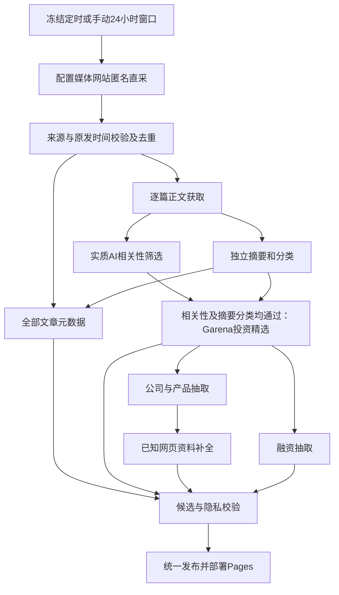

# 新闻Daily 统一新闻链路

直采可靠性：逐源health区分失败、待正文、列表内无窗口文章及未完成覆盖；单篇恢复只重取原批次明确选定的失败详情，其余响应从哈希核验的私有证据回放。新集合保持原窗口，旧状态和成功文章不覆盖，后续加工与发布仍经候选审核。入口及限制见[直采说明](../operations/DIRECT_NEWS_COLLECTION.md)。

2026-09-23 当前决定：暂时完全停用 Manus，默认 `direct-only`，`full` 同样指向网站直采。按配置媒体列表及详情匿名读取，通过来源、原始时间校验后进入本文两池逻辑。标记 `collector=direct_site` 和 `direct:` ID，不伪装为 Manus；模型统一为并行科技 DeepSeek-V4-Pro。`config/services.json` 在真实 HTTP 前关闭 Manus 与 Tavily；GitHub 已恢复北京时间每天09:30定时（默认UTC `30 1 * * *`），手动入口保留，Codex定时跟进未恢复。公司、产品与融资仍仅消费精选。见[媒体页面直采](../operations/DIRECT_NEWS_COLLECTION.md)。

历史沿革：2026-09-22 曾切换为仅 Manus，现已由网站直采替代；已验证的旧 Manus 档案与来源身份保留。AIHOT 采集、日报与热点、旧上游接口回退均退役；仓库名与 `/AI-HOT/` 部署路径保留。历史双源及 Manus 运行的证据见 `docs/history/`，不能用旧结果证明新链路已验收。

## 两个文章池

`#/all` 为“全部文章”：本次网站直采中通过来源身份、原始时间和窗口校验的条目，经去重后保留安全元数据。缺正文、明确不相关、单条模型失败均不删除合规的标题、来源、日期与原文链接。来源或时间尚未核清的候选留在私有隔离队列。

2026-09-23用户确认：所有合格正文都独立生成摘要与分类。相关性筛选和摘要分类在逻辑上解耦，相关性为否不能阻止该篇打标；这不表示网络请求并行执行。非精选文章照常展示分类，非 AI 内容不强制填写 AI 维度。没有正文不根据标题猜分类。

`#/selected` 为“Garena投资精选”：正文达到既有证据要求后，完成实质 AI 相关性筛选、摘要和分类。当前是广义 AI 新闻标准，不额外引入投资分数或未经确认的赛道限制。公司、产品与融资新增只消费精选；明确空精选不回退全部、旧 feed 或历史。

- 私有 `inputs/processed.json.items` 是精选输入，`allArticles` 是全量安全元数据。
- 公开 `snapshot.newsSelectionVersion=1`，`all` 与 `garenaSelected` 独立存在；缺池是错误，空池是合法值。
- `garenaSelection.status` 为 selected / not_selected / pending。普通元数据不需要先获得分类或摘要才可阅读。
- `contentStatus` 为 available / awaiting_body；`classificationStatus` 和 `summaryStatus` 各为 complete / pending / failed，与是否精选分别记录。缺正文显示“待正文”，有正文分类未处理或失败分别显示“待打标”或“打标失败”，不能一律解释为“未分类”。
- 两池共有 ID 的展示字段一致，仅列表序号可以不同。`collectionStatus.articleLibraryCount` 计全部，`selectedArticles` / `publishedArticles` 计精选。
- 浏览器仅消费本批明确的文章池，验证 collector 与 ID 前缀对应；不从旧日报、周报、演示条目或旧浏览器补录填充。schema3 直采 feed 保留兼容路径 `data/manus/current.json`，旧 schema1/2 仍严格保留 Manus 身份。

## 窗口、身份与正文

GitHub 定时使用 UTC cron `30 1 * * *`（北京时间每天 09:30）。核对本次 run 的审计状态、event、run ID、attempt 与 head SHA 后，以 `created_at` 转北京时间最近已到达的 09:30 冻结截止时刻：09:30 前创建取前一天 09:30，之后取当天 09:30；窗口为此前 24 小时 `[start, end)`。`NEWS_COLLECTION_END` 贯穿各阶段，排队跨午夜或重跑不滑窗；创建时间无法可靠取得时，在采集与模型付费前停止。手动运行仍在启动时冻结 `rolling-24h`，可用含时区的 `--window-end` 显式指定；恢复沿原窗口。

只接受文章原始发布/发送时间。评论、点赞、推荐、编辑时间及 URL 路径日期都不能让旧内容续期。中国媒体缺时区的绝对时间按已确认平台规则解释为 Asia/Shanghai；有偏移时间按同一时刻转换。

“昨天”必须指发布且保留原文证据，可按采集时北京时间前一自然日例外纳入；日期精度不补造时分。小时/分钟相对时间保留文字、接收时刻及估算标识，边界含糊隔离。明确绝对原发时间不能被相对文字覆盖；冲突条单独隔离并继续其他文章。

配置媒体、承载平台及主页三字段共同确定来源。官网、腾讯作者页、网易号转载不能冒称公众号原文。作者缺失本身不拒收；明确识别的第三方发布者仍须按来源规则区分。

正文通过免费脚本抓取，原生提取每篇独立子进程并限制输入、输出和时间；坏篇不会杀掉整批。腾讯手机页到新闻页的跳转仅在 HTTPS、已知 host/path 与同一 article ID 严格匹配时放行，标题、风控、正文长度门槛继续生效。全文只留私有输入，不进入 public JSON。

## 采集与成本

`config/manus_sources.json` 保留为 20 个媒体入口的配置文件，当前由直采模块读取，最多并发 3 个来源。使用匿名公开页面，不带登录 cookie，不绕过验证码或访问限制；来源阻挡及详情失败如实记录。每源读取与翻页边界见直采说明，列表提示不能替代详情核验。

合格正文进入并行科技 DeepSeek-V4-Pro 的相关性及独立摘要分类，精选再进入公司和融资抽取。成功缓存绑定输入、模型和提示词版本；系统性模型异常停止扩大请求并保留已完成结果。扩充模型用量授权不改变证据、缓存、失败隔离及候选发布门禁。

前端设置页已删除，配置使用 `.env` / 仓库 Secrets；独立后台设置服务、测试接口与 CLI 保留兼容，无设置 UI。本地 `PARATERA_API_KEY` 在并行科技域名优先，旧 `DEEPSEEK_API_KEY` 可为兼容别名；GitHub 仅使用 `PARATERA_API_KEY`，固定并行科技地址与模型，无其他提供商回退。网页抓取与模型文本加工分开，模型不会自行获得联网搜索能力。原始响应、完整正文与模型诊断只保存在私有 work/ 并按恢复流程加密。

历史 Manus 的逐篇 checkpoint、seed 未处置审计、credits 观察止损、终态及迟到回收记录继续保留，当前不创建或恢复 Manus 任务。观察费用从来不等于服务端硬上限；旧 complete/partial 或可获取样本也不能证明本次直采全窗口无遗漏。

## 公司与融资

`company-evidence.json` 在私有输入目录按精选 ID 保存完整证据。成功缓存绑定正文、模型和提示词版本；人工修正单独保存原文指纹与审核记录，不能把旧缓存伪装成新版本。

公司按最新相关新闻排序，资料核验时间独立。产品区分 owned / integrated / used / unknown；纯论文方法、通用功能不是具名产品。公司、基金会、开源组织保留已核实身份；集成方、赞助方不自动取得产品所有权。单轮融资、市值、拟议交易估值与累计融资分别保留原文状态。

迁移已删除 AIHOT 专属新闻及仅由其支撑的实体贡献；保留经核验的旧 Manus / 直采 / 独立官网证据、合法成功缓存及既有费用账本。后续仅从当前精选增量更新，历史文章不重新混入本批触发付费处理。

当前直采公司阶段显式启用 `--research-full-review`，取消每日 5 主体 / 10 页 / 5 请求上限，处理有限的缺资料主体队列，每主体最多 2 个已知网页、每输入最多 1 次新模型请求。成功结果复用且保留原核验日期；失败或状态不明不自动重试，系统异常熔断。全量模式不搜索新链接、不调用 Manus，不能称为模型联网检索。默认小样本及历史恢复保持旧预算语义；云端账本无法证明可复用时仍保留运行归属租约和恢复门禁，可选补全延后不阻断主新闻链路。本地共享账本不受云租约约束。见[公司资料补全](../operations/COMPANY_WEB_RESEARCH.md)。

## 失败与发布

| 情形 | 处理 |
| --- | --- |
| 部分直采来源失败或覆盖不全 | 处理其余已校验文章，保留真实来源状态 |
| 有充分证据的窗口内零篇 | 合法空结果，不等于采集失败 |
| 单篇正文失败 | 全部文章保留合规元数据，该篇不进入需要正文的模型步骤 |
| 相关性为否但正文合格 | 独立摘要分类，结果进入全部文章；不进入精选或公司融资抽取 |
| 单篇相关性、摘要分类或公司抽取失败 | 独立记录，不删除其他合格成果 |
| 所有来源不可用、模型系统性失败或跨产物校验失败 | 保留旧正式产物，不用空结果掩盖故障 |
| 显式空精选 | 公司/融资不回读全量或旧 feed |

公开快照包含窗口、逐源状态和文章去向统计；前端保持新闻阅读布局，诊断不冒充已覆盖。新闻、feed、公司、融资在同一个审核候选中校验后统一晋升，不能用当前旧 feed 为新批次补成功数。

`run_pipeline.py` 默认 `direct-only`；`full` 是直采兼容别名，当前 Manus 与 AIHOT 入口均停用。GitHub 定时与手动工作流均只允许 all/direct-only；真实调度、逐源覆盖及发布按[当前验收清单](../operations/NEXT_SCHEDULED_ACCEPTANCE.md)另验。`--no-promote` 仍会调用模型，完全离线检查使用 `test_pipeline.py offline`。`--resume` 恢复原窗口与成功缓存；已完成发布的运行不重复发布。

## 2026-09-23 独立打标调整

本节记录独立打标调整时的历史批次：当时9月22日发布数据为37篇全部文章、11篇精选。逐条拼接正文、相关性、加工审核及公开快照后，26篇未分类分为：15篇只做相关性筛选，因结果为否被旧流程跳过摘要分类；10篇机器之心缺正文，未发送模型；1篇Jev相关性通过但分类加工失败。已有11篇分类与摘要完整保留，没有前端漏读。缓存回放中的 `modelAttempted=false` 不能据此否认原轮请求；原轮审核记录需一起读取。私有逐篇诊断：[unclassified-diagnostic-20260923.json](../../work/news-daily-rollout-20260922/unclassified-diagnostic-20260923.json)（仅本地work文件，不随公开站点发布）。

Jev文章 `manus:5b57ba973c441488` 有3499字符正文，原轮记录 `modelAttempted=true` 和非系统性 `content` 错误。结合该次代码路径，可定位到发布类 `release_evidence` 校验门禁：证据需为至少4字符且在正文中逐字出现的字符串。旧轮未保存原始模型JSON，无法进一步证明是缺失、过短、类型错误或原文不匹配，不能把fallback摘要当模型原回答。新的 `modelResponse` / `validationReason` 诊断只留私有inputs，不进入public。

本轮实现和真实补处理已完成：精选处理沿用v4成功缓存，其余合格正文走独立 `library-v1` 分类口径；复用11篇旧成功结果，对16篇缺项补处理。Jev本次响应证明证据仅空白差异，修复连续匹配后离线重放成功，新增精选及单篇公司处理。最终37篇全部文章中27篇已分类、10篇待正文、12篇精选；非精选仍不进入公司或融资抽取。新增请求共16次正文加工及1次公司抽取，未新增Manus请求。销量里程碑边界、4篇摘要审校及公司归属修正一并审核晋升，详情见[本轮记录](../history/2026-09-23-INDEPENDENT_CLASSIFICATION.md)。线上发布必须另核对应提交的Pages和JSON，不用离线测试代替。

## 公开文件退役

旧 HTML、日报/周报页、company review/enrichment 页及旧补录 JSON 可能仍被静态构建复制；只移除导航不足以阻止访问。`scripts/retire_legacy_public.py` 仅接受项目 work/ 下候选，默认生成清单，显式 `--apply` 后逐文件删除。必要数据 JSON 字节保持不变，调用方同步清理已退役导航并完成普通候选校验。

源目录必须保留 `snapshot.json`、`company-overview.json`、`funding-table.json`、`favicon.svg`；存在时保留 `publication-receipt.json` 和 `pipeline-status.json`。其他来源状态 JSON 在审核后用 `--keep` 明确保留。完整正文、模型 trace 和私有输入不能通过此选项公开。

静态构建另外生成 `index.html`、`404.html`、`.nojekyll` 与 JS/CSS 等构建资源；这些在 `web/dist/client/`，不属于旧 public 清理范围。GitHub Pages 的 `/AI-HOT/` 路径不变。历史说明与真实运行报告留在 `docs/history/`，不改写原状态或声称离线测试替代真实来源验收。
