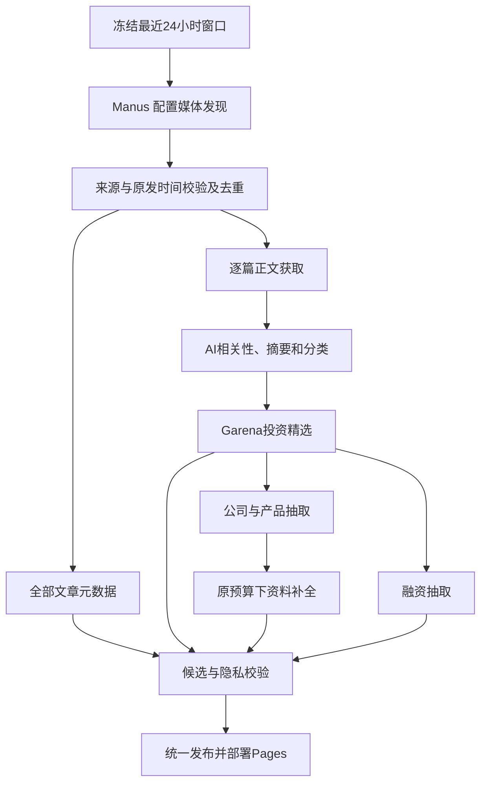

# 新闻Daily 统一新闻链路

2026-09-22 起仅使用 Manus 新闻来源。AIHOT 采集、日报与热点、旧上游接口回退均退役；仓库名与 `/AI-HOT/` 部署路径保留。历史双源运行的证据见 `docs/history/`，不能用旧结果证明新链路已验收。

## 两个文章池

`#/all` 为“全部文章”：本次 Manus 发现中通过来源身份、原始时间和窗口校验的条目，经去重后保留安全元数据。缺正文、明确不相关、单条模型失败均不删除合规的标题、来源、日期与原文链接。来源或时间尚未核清的候选留在私有隔离队列。

`#/selected` 为“Garena投资精选”：正文达到既有证据要求后，完成实质 AI 相关性筛选、摘要和分类。当前是广义 AI 新闻标准，不额外引入投资分数或未经确认的赛道限制。公司、产品与融资新增只消费精选；明确空精选不回退全部、旧 feed 或历史。

- 私有 `inputs/processed.json.items` 是精选输入，`allArticles` 是全量安全元数据。
- 公开 `snapshot.newsSelectionVersion=1`，`all` 与 `garenaSelected` 独立存在；缺池是错误，空池是合法值。
- `garenaSelection.status` 为 selected / not_selected / pending。普通元数据不需要先获得分类或摘要才可阅读。
- 两池共有 ID 的展示字段一致，仅列表序号可以不同。`collectionStatus.articleLibraryCount` 计全部，`selectedArticles` / `publishedArticles` 计精选。
- 浏览器仅消费本批明确的 Manus 池；不从旧日报、周报、演示条目或旧浏览器补录填充。

## 窗口、身份与正文

默认 `rolling-24h` 在扫描开始时冻结北京时间结束时刻，起点为此前 24 小时，采用 `[start, end)`。`--window-end` 或保存的恢复状态可显式确定结束时刻；耗时和后续模型处理不会移动窗口。旧固定窗口可显式使用 `ten-am` 与 09:30，旧自然日兼容模式与当前窗口分开。

只接受文章原始发布/发送时间。评论、点赞、推荐、编辑时间及 URL 路径日期都不能让旧内容续期。中国媒体缺时区的绝对时间按已确认平台规则解释为 Asia/Shanghai；有偏移时间按同一时刻转换。

“昨天”必须指发布且保留原文证据，可按采集时北京时间前一自然日例外纳入；日期精度不补造时分。小时/分钟相对时间保留文字、接收时刻及估算标识，边界含糊隔离。明确绝对原发时间不能被相对文字覆盖；冲突条单独隔离并继续其他文章。

配置媒体、承载平台及主页三字段共同确定来源。官网、腾讯作者页、网易号转载不能冒称公众号原文。作者缺失本身不拒收；明确识别的第三方发布者仍须按来源规则区分。

正文通过免费脚本抓取，原生提取每篇独立子进程并限制输入、输出和时间；坏篇不会杀掉整批。腾讯手机页到新闻页的跳转仅在 HTTPS、已知 host/path 与同一 article ID 严格匹配时放行，标题、风控、正文长度门槛继续生效。全文只留私有输入，不进入 public JSON。

## 采集与成本

`config/manus_sources.json` 定义 20 个媒体入口，最多并发 3 个。每源依次获得启动机会，但创建状态不明、余额不足、费用持续不可见、远端停止未确认等系统性异常会阻止扩大任务。

每篇已核实 checkpoint 先回传再继续扫描。公开预读 seed 只是线索；传给模型的候选与因压缩省略的候选都有私有记录。已知未处置 seed 阻止来源宣称 complete，但不把 seed 自身当作新闻证据。`complete`、`partial` 与 `failed` 分别表示完成扫描、保留合格样本但覆盖不全、未交付合格文章且失败；零篇只有在确证扫描无更新时才能记 complete。

credit 阈值是观察止损，不是服务端硬费用上限。余额按 agent profile 计算；每日 refresh credits 仅能用于支持的 Lite 档位。任务创建、stop 接受、终态确认、终态费用独立记录。确认停止后允许有界迟到结果读取，仍执行正常契约校验，不创建或恢复任务。原始请求、verbose 轨迹、完整响应只保存在私有 work/ 并按恢复流程加密，工具日志不变成文章。

## 公司与融资

`company-evidence.json` 在私有输入目录按精选 ID 保存完整证据。成功缓存绑定正文、模型和提示词版本；人工修正单独保存原文指纹与审核记录，不能把旧缓存伪装成新版本。

公司按最新相关新闻排序，资料核验时间独立。产品区分 owned / integrated / used / unknown；纯论文方法、通用功能不是具名产品。公司、基金会、开源组织保留已核实身份；集成方、赞助方不自动取得产品所有权。单轮融资、市值、拟议交易估值与累计融资分别保留原文状态。

迁移时删除 AIHOT 专属新闻及仅由其支撑的实体贡献；保留经核验的 Manus / 独立官网证据、合法成功缓存及既有费用账本。后续仅从当前精选增量更新，历史文章不重新混入本批触发付费处理。资料补全继续遵循已确认的每日 5 主体 / 10 页 / 5 模型预算；其他独立发现费用边界见操作说明，迁移不重置预算。

## 失败与发布

| 情形 | 处理 |
| --- | --- |
| 部分 Manus 来源失败或覆盖不全 | 处理其余已校验文章，保留真实来源状态 |
| 有充分证据的窗口内零篇 | 合法空结果，不等于采集失败 |
| 单篇正文失败 | 全部文章保留合规元数据，该篇不进入需要正文的模型步骤 |
| 单篇相关性、摘要分类或公司抽取失败 | 独立记录，不删除其他合格成果 |
| 所有来源不可用、模型系统性失败或跨产物校验失败 | 保留旧正式产物，不用空结果掩盖故障 |
| 显式空精选 | 公司/融资不回读全量或旧 feed |

公开快照包含窗口、逐源状态和文章去向统计；前端保持新闻阅读布局，诊断不冒充已覆盖。新闻、feed、公司、融资在同一个审核候选中校验后统一晋升，不能用当前旧 feed 为新批次补成功数。

`run_pipeline.py` 默认 `manus-only`；`full` 为兼容别名，`aihot-only` 拒绝。`--no-promote` 仍可能付费，完全离线检查使用 `test_pipeline.py offline`。定时当前关闭。`--resume` 恢复原窗口与成功缓存；已完成发布的运行不重复发布。

## 公开文件退役

旧 HTML、日报/周报页、company review/enrichment 页及旧补录 JSON 可能仍被静态构建复制；只移除导航不足以阻止访问。`scripts/retire_legacy_public.py` 仅接受项目 work/ 下候选，默认生成清单，显式 `--apply` 后逐文件删除。必要数据 JSON 字节保持不变，调用方同步清理已退役导航并完成普通候选校验。

源目录必须保留 `snapshot.json`、`company-overview.json`、`funding-table.json`、`favicon.svg`；存在时保留 `publication-receipt.json` 和 `pipeline-status.json`。其他来源状态 JSON 在审核后用 `--keep` 明确保留。完整正文、模型 trace 和私有输入不能通过此选项公开。

静态构建另外生成 `index.html`、`404.html`、`.nojekyll` 与 JS/CSS 等构建资源；这些在 `web/dist/client/`，不属于旧 public 清理范围。GitHub Pages 的 `/AI-HOT/` 路径不变。历史说明与真实运行报告留在 `docs/history/`，不改写原状态或声称离线测试替代真实来源验收。
