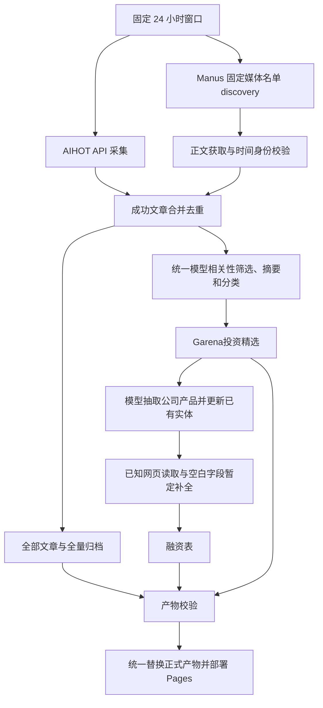

2026-09-18修复：AIHOT 使用上游 `by=timeline` 时间轴归入固定北京时间窗口：通常取 discoveredAt；原发布距收录超过72小时的历史回填取 publishedAt。该选批过程不套用 Manus 原始发布时间审核。选定批次后直接进入共享模型处理，快照/首页完整消费已批准集合，不再次按原文日期删条。较早发布的当批文章写入相应原文日期归档，保留原发布时间，不冒充当天发布。Manus 原始发送时间校验保持。

2026-09-15新确认：每日最多1个公司或待归属产品使用Manus Lite寻找资料链接，20credits观察止损、创建不重试；与20个新闻媒体采集配额分开。发现链接进入网页读取及DeepSeek验证，暂定标量只补公司空白，产品仅记录candidateOwners不合并。GitHub任务创建前以每日缓存持久化运行所有者占位并读回确认；同日另一轮或重跑不再创建。aihot-only不调用此Manus步骤。

2026-09-15更新：已获用户确认，统一每日overview阶段启用已知网页补全（--known-link-research），读取审核资料链接及当前公司相关新闻，最多检查5个主体/10页/5次DeepSeek请求，无新增Manus搜索。自动补空白字段标暂定、保留引文；不覆盖现有字段、不更改归属。按主体、模型和最新报道去重，同输入成功/失败均跳过；失败逐页/逐公司隔离，剩余队列后续轮次处理。新报道可再次触发。无新报道时不会主动轮询官网变化。

# 统一新闻链路（2026-09-22）

## 全部文章与 Garena 投资精选

2026-09-22 用户确认分为两个阅读入口。`#/all` 为“全部文章”：AIHOT 与 Manus 成功采集的文章经过既有来源、时间核验和去重后全部保留。AI 不相关、缺正文或单条模型加工失败只影响精选资格，不删除已核实的文章标题、来源、时间及原文链接。来源或原始发布时间存在冲突的 Manus 条目仍留在私有核验队列，不以“全部文章”绕过原有收录规则。

`#/selected` 为“Garena投资精选”：沿用现有实质 AI 相关性标准，再完成摘要、分类校验。当前仍是广义 AI 新闻筛选，不额外使用分数、AIHOT 上游 selected、投资回报预测或未确认的赛道限制。公司、产品和融资只从本批精选抽取；未入选的新文章不会自动扩充公司库。旧公司、产品、研究证据保留，既有主体仍可进入原有联网补全队列，配额不因两池迁移重置。

契约：`inputs/processed.json.items` 保持精选输入，`allArticles` 保存全量安全元数据；`snapshot.newsSelectionVersion=1`、`snapshot.all` 与 `snapshot.garenaSelected` 分别表示全部和精选。独立 `garenaSelection.status` 为 selected / not_selected / pending，不借用上游 selected 字段。显式空精选不从全部、旧 feed、历史或前端补录回填；新格式缺精选池须拒绝。两池中同 ID 的正文以外展示字段一致，仅列表序号可不同。

`collectionStatus.articleLibraryCount` 计全部文章，`selectedArticles` 与兼容字段 `publishedArticles` 计精选，`excludedArticles` 表示不入精选，不再表示无法阅读。全量元数据另存 `data/archive/all-articles/<窗口结束日>.json`；原每日/周报归档继续保存精选。私有完整正文、失败模型响应不进入公开文件。旧快照无分流字段时，其 all 池本来已经通过筛选，可兼容视为旧精选。

系统性模型故障仍保留旧版整体发布，避免把服务故障当成“无精选”；新的全量候选在付费加工前保存，供后续恢复。普通单条失败、明确未入选或有效空精选不会丢失全量阅读入口。定时仍关闭，只有手动工作流与代码部署。

主体扩展：用户允许明确具名且有官网证据的基金会／开源组织进入公司产品库，entityType保留非商业类型，产品前端显示“维护”，赞助不作归属依据。类型证据随审核规则保存并在每日合并后恢复；不改变新闻分类或报道排序。

公司资料搜索的独立试验入口见[联网核验](../operations/COMPANY_WEB_RESEARCH.md)。每日链路仍使用新闻抽取和已审阅资料规则；新GLM搜索尚待业务样本验证，未自动启用。

Manus只依据文章原始发布／发送时间收录，新增点赞、评论、互动、编辑或转载页面的刷新时间均不能使旧文章重新符合窗口。“昨天”等相对文字必须指文章发布，不得引用评论或互动时间。AIHOT批次不做这层原文时间拦截，先接收再进入相关性、摘要打标与公司更新流程；URL路径日期不作为发布时间判定。已确认的北京时间09:30窗口及“昨天”发布的自然日例外保持。

日常入口为 `scripts/run_pipeline.py run --stage all`，当前仅手动启动，固定覆盖北京时间前一日 09:30（含）至所选结束日 09:30（不含）。窗口不会随实际启动时间移动。

## 采集和公司库各管什么

- `config/manus_sources.json` 是 20 个固定媒体入口，决定 Manus 到哪里找新闻；不是公司情报库名单。`config/accounts.json` 是候选来源配置，不自动转成生产采集任务。
- AIHOT 与 Manus discovery 同时启动，任何一条采集线失败不会直接取消另一条。现有 RSS 等 AIHOT 上游来源随 AIHOT 输入进入；本改动没有新增一个独立 RSS 抓取器。
- Manus 正文优先，AIHOT 使用接口提供的标题与摘要作为证据。按链接或完全相同的规范化标题去重，`sourceRefs` 保留重复条目的来源与链接；不把官网、腾讯作者页称作已验证公众号。
- 同一Manus来源内部也允许部分覆盖：逐篇检查点通过来源和时间校验后保存；止损或边界未完成时，合格文章继续进入正文与模型加工，来源标partial。“昨天”按采集记录时的北京时间归入前一自然日，全天纳入；相对小时/分钟保留估算标识，区间跨边界则隔离。只有进度叙述的内容不纳入。
- 模型统一判断 AI 相关性，生成本站摘要与标签。AIHOT 原标签不作为本站最终分类。所有本批次候选都进入模型处理，缓存仅复用内容与版本匹配的结果。
- 摘要提示词 enrich-v4：历史回顾、人物访谈和长文须结合标题与所给全文覆盖有正文依据的 AI 主线，包括相关的后半段内容；保留原文日期与观点归属，不把旧事当新增发布或融资。旧缓存保留原版本，不改标、不批量重跑；离线恢复仍须匹配原提示词版本。
- 模型从通过筛选的新闻抽取公司、产品、归属及字段，新增实体或合并更新已有实体；既有身份核验规则继续生效。公司按最新相关新闻排序，保留原文链接及更新日期。旧公司保留，历史周报文章不重新混入本批次触发更新。
- AI 日报沿用 AIHOT 独立成品日报；热点是抓取时榜单，两者不冒充固定窗口内自建新闻。历史归档和周报继续包含历史新闻。

## 失败与发布规则

| 情形 | 处理 |
|---|---|
| AIHOT 成功、部分或全部 Manus 失败 | 加工 AIHOT 及任何通过校验的 Manus 文章；页面列出失败/不完整来源 |
| AIHOT 失败、部分 Manus 成功 | 加工已校验的 Manus 文章，标明 AIHOT 缺失 |
| 已核实来源在窗口内零篇 | 合法空结果，与采集失败区分 |
| 所有来源不可用 | 不发布，保留旧网页 |
| 单条相关性、摘要分类或公司抽取失败 | 隔离并公开条目/原因；其他合格结果继续，公司原有资料保留 |
| 模型阶段全部失败或没有可发布结果 | 保留旧网页，防止空结果覆盖 |
| Manus 发现失败且正文模式需继续付费 | 不启动新的付费正文任务，只利用已校验的结果 |

`collectionStatus` 随快照发布，包含固定窗口、逐来源状态、发现/可用数量，以及候选、排除、发布数量。状态为 `complete`、`partial`、`failed` 或 `not_requested`。新闻首页显示缺失来源。本批次的空 Manus feed 显式覆盖旧 feed，不能拿旧文章补成“今日已成功”。

统一快照只消费 `inputs/processed.json`，不再次拉取 API 或合并正式旧 Manus feed。当前窗口归档以本批次审核结果为准，避免已排除文章从旧快照重新出现；窗口外历史保留。

## 运行与追溯

- 新模块 `scripts/news_pipeline.py` 负责独立 AIHOT 输入、Manus 结果校验、共同文章池及模型处理。
- `work/runs/<date>/ten-am/<run-id>/workspace/inputs/` 保存本次输入与审核结果，不提交原始正文。`state.json` 记录阶段状态；来源状态在公开快照中另行记录。
- `--source-mode aihot-only` 仅取消 Manus，仍运行模型、公司库和融资步骤；需要模型密钥，可能产生模型/可选搜索费用。`--skip-search` 关闭可选 Tavily。
- `--no-promote` 生成候选但不更新正式数据，并不禁止付费；完全离线验证用 `python scripts/test_pipeline.py offline`，查看计划用 `run --dry-run`。
- `--resume` 复用成功阶段与模型缓存。重试采集后会重新运行受影响的下游步骤，防止新增输入遗漏。已完成发布的运行不会再次发布。
- 单独 `--stage snapshot` 等旧命令仅供定点调试，不等同于上述完整链路。旧 `aihot-only --stage snapshot` 仍是无模型快照调试，不应用于每日生产更新。

2026-09-14 后续验收按[投资人验收口径](../operations/INVESTOR_ACCEPTANCE.md)执行。公司抽取独立读取私有 company-evidence.json；最新报道日期与资料更新日期分开保存，默认仅按报道时间排序。真实运行结果与发布结论另行记录，不以离线测试代替内容质量验收。

本轮后续修正见 docs/history/2026-09-14/QUALITY_CORRECTIONS_20260914.md：新闻分类与产品归属独立，个人产品保留pendingEntities并展示；已核实旧闻逐条隔离，未泛化为全网原文时间已验证。

产品关系规则（2026-09-14确认）：仅开发／运营主体记为自有；集成、使用第三方产品保留为该公司的产品动态，按最新关联报道排序并保留日期、链接。productUpdates逐文章记录owned/integrated/used/unknown及引文，product_names兼容表示所有关联产品，不代表所有权。历史关联证据不足标关系待核实；纯论文、架构和算法方法不进产品库，可实际使用的开源工具保留。抽取提示词v9，旧缓存不伪装新版本。

公司抽取v11：关系以公司为主语、产品为宾语，集成方必须保留被集成产品。另一公司集成的同名工具若仅有工具描述、没有公司身份或开发运营证据，降为待核实产品；仍保留集成动态。此为狭义证据门禁，未代表所有公司身份已核验。

审核重抽可使用build_company_overview.py --replace-product-evidence：只清理成功复核文章的旧产品贡献再合入新结果，其他日期／失败文章／研究证据保留。每日增量默认不清理历史贡献。品牌归属合并携带产品动态；人工名称与主体判定按文章ID限定，保留配置和历史报告溯源。

### 2026-09-14 展示与产品归属补全

首页保留新闻阅读与分类筛选，融资表格位于公司与产品全景；融资文章仍进入统一新闻处理。页面不显示评分、采集状态框和原解释段，采集诊断数据保留。具名产品才进入产品列表；未具名集合只留公司业务/原新闻。已审阅官网补全规则以 owned_products 指定报道已提及的产品，不顺带导入官网其他产品；productUpdates.ownershipEvidence 保存归属网页、引文与核验时间，publishedAt/url仍指关联报道。无法核实公司归属的具名产品留待核验，不计正式产品。

当前DeepSeek是普通对话接口。本轮采用外部官网检索后交给DeepSeek核验，不等于每日自动联网搜索；自动检索尚需配置并确认搜索服务。
