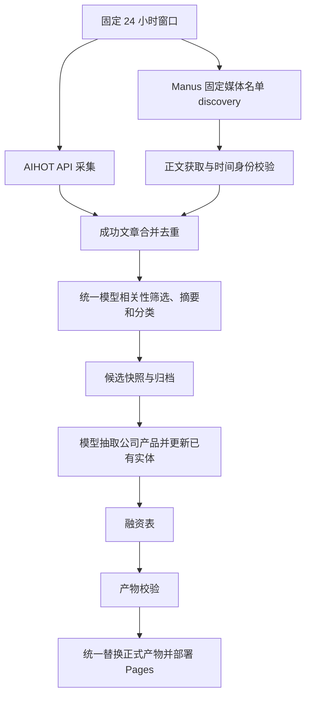

# 统一新闻链路（2026-09-14）

日常入口为 `scripts/run_pipeline.py run --stage all`，默认北京时间 09:30 调度，固定覆盖前一日 09:30（含）至当天 09:30（不含）。GitHub 排队可能延迟启动，窗口不会随之移动。

## 采集和公司库各管什么

- `config/manus_sources.json` 是 20 个固定媒体入口，决定 Manus 到哪里找新闻；不是公司情报库名单。`config/accounts.json` 是候选来源配置，不自动转成生产采集任务。
- AIHOT 与 Manus discovery 同时启动，任何一条采集线失败不会直接取消另一条。现有 RSS 等 AIHOT 上游来源随 AIHOT 输入进入；本改动没有新增一个独立 RSS 抓取器。
- Manus 正文优先，AIHOT 使用接口提供的标题与摘要作为证据。按链接或完全相同的规范化标题去重，`sourceRefs` 保留重复条目的来源与链接；不把官网、腾讯作者页称作已验证公众号。
- 同一Manus来源内部也允许部分覆盖：逐篇检查点通过来源和时间校验后保存；止损或边界未完成时，合格文章继续进入正文与模型加工，来源标partial。没有精确时间或只有进度叙述的内容不纳入。
- 模型统一判断 AI 相关性，生成本站摘要与标签。AIHOT 原标签不作为本站最终分类。所有本批次候选都进入模型处理，缓存仅复用内容与版本匹配的结果。
- 模型从通过筛选的新闻抽取公司、产品、归属及字段，新增实体或合并更新已有实体；既有身份核验规则继续生效。公司按最新相关新闻排序，保留原文链接及更新日期。旧公司保留，历史周报文章不重新混入本批次触发更新。
- AI 日报沿用 AIHOT 独立成品日报；热点是抓取时榜单，两者不冒充固定窗口内自建新闻。历史归档和周报继续包含历史新闻。

## 失败与发布规则

| 情形 | 处理 |
|---|---|
| AIHOT 成功、部分或全部 Manus 失败 | 加工 AIHOT 及任何通过校验的 Manus 文章；页面列出失败/不完整来源 |
| AIHOT 失败、部分 Manus 成功 | 加工已校验的 Manus 文章，标明 AIHOT 缺失 |
| 已核实来源在窗口内零篇 | 合法空结果，与采集失败区分 |
| 所有来源不可用 | 不发布，保留旧网页 |
| 相关性、摘要分类或公司抽取未完整完成 | 不发布，保留旧网页；来源降级不等于允许模型半成品 |
| Manus 发现失败且正文模式需继续付费 | 不启动新的付费正文任务，只利用已校验的结果 |

`collectionStatus` 随快照发布，包含固定窗口、逐来源状态、发现/可用数量，以及候选、排除、发布数量。状态为 `complete`、`partial`、`failed` 或 `not_requested`。新闻首页显示缺失来源。本批次的空 Manus feed 显式覆盖旧 feed，不能拿旧文章补成“今日已成功”。

统一快照只消费 `inputs/processed.json`，不再次拉取 API 或合并正式旧 Manus feed。当前窗口归档以本批次审核结果为准，避免已排除文章从旧快照重新出现；窗口外历史保留。

## 运行与追溯

- 新模块 `scripts/news_pipeline.py` 负责独立 AIHOT 输入、Manus 结果校验、共同文章池及模型处理。
- `work/runs/<date>/ten-am/<run-id>/workspace/inputs/` 保存本次输入与审核结果，不提交原始正文。`state.json` 记录阶段状态；来源状态在公开快照中另行记录。
- `--source-mode aihot-only` 仅取消 Manus，仍运行模型、公司库和融资步骤；需要模型密钥，可能产生模型/可选搜索费用。`--skip-search` 关闭可选 Tavily。
- `--no-promote` 生成候选但不更新正式数据，并不禁止付费；完全离线验证用 `python scripts/test_pipeline.py offline`，查看计划用 `run --dry-run`。
- `--resume` 复用成功阶段与模型缓存。重试采集后会重新运行受影响的下游步骤，防止新增输入遗漏。已完成发布的运行不会再次发布。
- 单独 `--stage snapshot` 等旧命令仅供定点调试，不等同于上述完整链路。旧 `aihot-only --stage snapshot` 仍是无模型快照调试，不应用于每日生产更新。

2026-09-14 后续验收按[投资人验收口径](../operations/INVESTOR_ACCEPTANCE.md)执行。公司抽取独立读取私有 company-evidence.json；最新报道日期与资料更新日期分开保存，默认仅按报道时间排序。真实运行结果与发布结论另行记录，不以离线测试代替内容质量验收。
