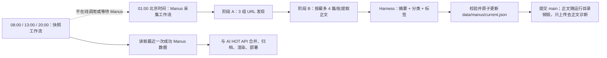

# Manus 唯一公众号信源与 Harness 接入实施计划

> **For Codex:** REQUIRED SUB-SKILL: Use `superpowers:executing-plans` to implement this plan task-by-task.

**目标：** 将 `ai news url crawler_20260810` 的 Manus 采集能力整合进 AI HOT，使 Manus 成为唯一的公众号采集信源；移除 WeRead/搜狗运行链路；让 Manus 返回的正文经过现有 harness 调用模型 API，生成摘要、分类和标签；改造后定时构建、归档、页面筛选和部署继续可用。

**目标架构：** 新增一个独立的 Manus 采集工作流，先发现指定日期文章，再以小批次提取正文，并在同一工作流中调用 harness 完成内容加工，最后原子更新规范化的 `data/manus/current.json`。现有 08:00 / 13:00 / 20:00 快照工作流不调用、不等待 Manus，只读取最近一次成功文件，并继续执行归档、渲染和部署。

**技术栈：** Python 3.11 标准库、Manus API v2、OpenAI-compatible `/chat/completions` 模型 API、GitHub Actions、现有静态快照/归档模板。

---

## 1. 范围、假设与最终决策

### 1.1 本计划中的“唯一信源”边界

- Manus 是唯一的**公众号文章采集信源**。
- 移除 WeRead、搜狗及其 token、映射表、状态文件、运行脚本和告警链路。
- 暂时保留 `https://aihot.virxact.com/api/public/items`，它仍是 AI HOT 既有的非公众号基础资讯源；本次不把它改成 Manus，也不改变它的归档语义。
- 如果后续决定“整个看板只保留 Manus，不再读取 AI HOT API”，应单独立项，因为这会改变空数据策略、日报/周报覆盖率和现有历史归档口径。

### 1.2 已确认的现状

- Manus 采集器位于仓库外层目录 `ai news url crawler_20260810/ai news url crawler_20260810/`，是 Python 3.11 标准库项目。
- 它把 A/B/C 三组并发提交到 Manus，轮询 `task.listMessages`，并按组保存原始 JSON。
- 当前 Manus schema 只有账号、平台、主页、文章 URL、标题、日期、作者和成功/失败状态；它明确不输出正文、摘要、分类和标签。
- 当前主项目的 harness 已位于 `scripts/tag_news.py` 和 `config/taxonomy.json`：支持模型 API 调用、JSON 解析、分类/标签 allowlist 校验、一次重试、兜底、缓存、并发和预算熔断。
- harness 当前只接收标题和摘要，每项最多 800 字符；它不读取正文，也不生成摘要。
- `scripts/build_snapshot.py` 当前通过 `--wechat-json` 读取公众号数据，合并 AI HOT API，写入日归档，再对已定稿条目调用 harness。
- `.github/workflows/update-snapshot.yml` 当前在每次快照构建前运行 `fetch_weread.py`，并依赖 `WEREAD_TOKEN`。

### 1.3 选定方案

采用“独立生产者 + 文件契约 + 独立消费者”，不在快照工作流中同步等待 Manus：



不用“一个 Manus 任务同时返回所有正文”的原因：长文章会显著放大结构化输出体积，单个来源异常也更容易拖垮整个组。两阶段设计保留现有严格的 URL/日期审计，并让正文失败能够按小批次重试和隔离。

### 1.4 已确认的取舍与账号清单策略（2026-08-17 用户拍板）

- **接受时效取舍**：公众号内容延迟约 1 天进入日报体系（`target_date` = 昨天，当天日报视图看不到新公众号文章）；如后续需要当天可见，另行立项增加白天补采任务，不阻塞本次迁移。
- **覆盖面渐进恢复**：Manus 初始清单维持现有 A/B/C 三组 14 个账号，不要求一次性对齐 `config/accounts.json` 的全量账号；后续按“验证可爬取一个、扩充一个”的节奏，把 `config/accounts.json` 中的账号逐步迁入 `config/manus_sources.json`。
- **因此 `config/accounts.json` 不在 Task 8 中删除**：转为扩容候选池保留（不再被任何生产链路调用），其账号信息逐步搬运至 `config/manus_sources.json` 后才可考虑归档。
- **模型预算必须重配**：现有 `budget_seconds=120` / `concurrency=8` 是按标题+摘要各 800 字符的轻调用设计的；正文 16,000 字符级调用单次耗时显著变长，Task 4 必须为正文加工单独配置预算与并发，否则会触发熔断导致批量跳过。

---

## 2. 目标数据契约

### 2.1 Manus 发现结果

保留现有 `source_group`、`target_date`、`articles` 主体，发现阶段仍只负责元数据和 URL；同时把 schema 升级为 v2，增加 `source_audits`，从数据结构上区分“来源成功但当天无文章”和“来源采集失败”：

```json
{
  "schema_version": 2,
  "source_group": "group_a",
  "target_date": "2026-08-16",
  "source_audits": [
    {
      "account_name": "游戏葡萄",
      "source_status": "complete",
      "article_count": 0,
      "note": "当天无文章"
    }
  ],
  "articles": []
}
```

新增本地严格校验：

- A/B/C 三组必须都有合法输出，才允许晋升新一版 `current.json`。
- 每个配置账号必须恰好出现一次 `source_audits` 结果；无文章时使用 `source_status=complete, article_count=0`，不能被误判为漏抓。
- `complete` 文章的账号、URL、标题和目标日期不能为空且必须匹配请求日期。
- `failed` 来源保留失败原因，但不进入可发布条目。

### 2.2 Manus 正文结果

第二阶段以发现结果中的文章 URL 为输入，每批最多 4 篇，要求 Manus 返回：

```json
{
  "target_date": "2026-08-16",
  "articles": [
    {
      "account_name": "机器之心",
      "article_url": "https://...",
      "title": "...",
      "published_date": "2026-08-16",
      "content_text": "清洗后的可读正文",
      "content_status": "complete",
      "content_truncated": false,
      "note": null
    }
  ]
}
```

正文门槛：

- 二次核对 URL、标题、账号和日期，避免 URL 跳转后提取到另一篇文章。
- `content_text` 去除导航、推荐阅读、版权脚注等明显页面噪声；保留自然段。
- 每篇返回正文设定可配置上限，初始值 20,000 字符；超限时从头部和尾部保留内容并标记 `content_truncated=true`。
- 正文过短、验证码页、登录页、空白页或字段不一致均视为失败，不进入模型加工和发布数据。
- 正文原文只存在于运行时工作目录，不进入 `public/`、Git 提交或 GitHub Artifact；工作流结束后由 runner 自动清理。诊断 Artifact 只保留 URL、状态、长度、哈希和错误原因，避免仓库膨胀和不必要的全文传播。

### 2.3 Harness 加工结果

每篇正文只做一次主要模型调用，同时产出：

```json
{
  "summary": "100—220 字的中文事实摘要",
  "category": "release",
  "tags": {
    "industry": "ai_model",
    "issuer": "startup"
  }
}
```

校验要求：

- `category` 和 `tags` 继续复用 `tag_news.validate()` 的 taxonomy allowlist、维度补齐与兜底机制。
- `summary` 必须为字符串、非空、长度在配置区间内，不得包含 Markdown 标题、链接或模型自述。
- 模型输入由标题、公众号名和正文组成；正文输入上限独立配置，初始建议 16,000 字符，而不是沿用当前 800 字符摘要上限。
- 第一次输出不可解析或摘要不合法时重试一次；第二次仍失败则使用正文首个有效段落生成确定性的截断摘要，并把分类降级到 `general`，记录 `enrichmentStatus=fallback`。
- 没有合格正文时不得用标题臆造摘要；该条进入失败统计，不进入发布数据。
- 缓存键包含稳定文章键、正文 SHA-256、taxonomy 版本、prompt 版本和模型名。正文、prompt 或模型变更时自动失效。

### 2.4 提供给 AI HOT 的规范化文件

提交文件：`data/manus/current.json`。

```json
{
  "schemaVersion": 1,
  "targetDate": "2026-08-16",
  "generatedAt": "2026-08-17T04:10:00+08:00",
  "collector": "manus",
  "ok": true,
  "degraded": true,
  "stats": {
    "configuredAccounts": 14,
    "completeAccounts": 13,
    "failedAccounts": 1,
    "discoveredArticles": 18,
    "publishedArticles": 17,
    "fallbackArticles": 1
  },
  "items": [
    {
      "id": "manus:稳定哈希",
      "title": "...",
      "summary": "...",
      "url": "https://...",
      "source": "公众号：机器之心",
      "sourceType": "wechat",
      "collector": "manus",
      "mpName": "机器之心",
      "sourcePlatform": "Tencent News",
      "author": null,
      "publishedAt": "2026-08-16T12:00:00+08:00",
      "publishedPrecision": "date",
      "contentSha256": "...",
      "enrichmentStatus": "complete",
      "classification": {
        "category": "release",
        "tags": {
          "industry": "ai_model",
          "issuer": "startup"
        },
        "autoFallback": false,
        "autoFilled": []
      }
    }
  ]
}
```

兼容性决定：

- 暂时保留 `sourceType: "wechat"`，保证当前“仅看公众号”筛选、历史归档和模板无需改枚举；新增 `collector: "manus"` 明确信源实现。
- `ok=true` 表示三组结果均通过契约校验并可安全消费；存在来源级失败时另设 `degraded=true`，避免把“部分来源失败”伪装成完整成功。
- 稳定 `id` 使用 `账号规范名 + 发布日期 + 规范化标题` 的哈希，不依赖可能变化的镜像或签名 URL。
- 只有日期没有时间时使用北京时间中午 12:00 作为排序占位，并显式写 `publishedPrecision: "date"`；页面不得展示为精确发布时间。
- `classification` 保存 taxonomy id；页面渲染阶段继续通过 `tag_news.to_display()` 转为中文标签。
- 全文不进入该文件；只保存正文哈希、摘要和模型加工结果。

---

## 3. 分阶段实施任务

以下工作目录均为 `AI HOT/ai hot-site/aihot-site/`。实施时应保护当前未提交改动，不得覆盖或回退与本迁移无关的文件。

### Task 1：先固化契约与离线夹具

**新增文件：**

- `tests/fixtures/manus/discovery-group-a.json`
- `tests/fixtures/manus/discovery-group-b.json`
- `tests/fixtures/manus/discovery-group-c.json`
- `tests/fixtures/manus/content-batch.json`
- `tests/fixtures/manus/current.json`
- `tests/pipeline/test_manus_contract.py`

**步骤：**

1. 从当前 Manus schema 制作去敏离线夹具，至少覆盖：正常文章、来源无文章、来源失败、正文截断、正文失败和重复 URL。
2. 先写失败测试，明确发现结果、正文结果和 `current.json` 的必填字段、枚举、日期匹配及额外字段策略。
3. 增加稳定 ID、日期精度、标题归一化和完整组检查测试。
4. 测试命令：`python -m unittest tests.test_manus_contract -v`。

**完成标准：** 数据契约测试先红；后续任务逐步把它们变绿。测试不调用 Manus 或模型 API。

### Task 2：把 Manus 客户端整合进主项目

**来源文件：**

- `../../../ai news url crawler_20260810/ai news url crawler_20260810/news_crawler/config.py`
- `../../../ai news url crawler_20260810/ai news url crawler_20260810/news_crawler/manus.py`
- `../../../ai news url crawler_20260810/ai news url crawler_20260810/news_crawler/schema.py`
- `../../../ai news url crawler_20260810/ai news url crawler_20260810/news_crawler/main.py`
- `../../../ai news url crawler_20260810/ai news url crawler_20260810/prompts/manus_system_prompt.md`

**目标文件：**

- `scripts/manus_source/__init__.py`
- `scripts/manus_source/client.py`
- `scripts/manus_source/config.py`
- `scripts/manus_source/contracts.py`
- `scripts/manus_source/runner.py`
- `prompts/manus_discovery.md`
- `config/manus_sources.json`
- `tests/pipeline/test_manus_client.py`

**步骤：**

1. 复制并重命名为主项目内模块，保留 Python 标准库实现，不新增浏览器或系统级依赖。
2. 把 14 个账号、A/B/C 分组、平台和主页从 prompt 移到 `config/manus_sources.json`，使其成为唯一配置源；运行时把对应组渲染进 prompt 附件，避免配置与 prompt 双份维护。
3. 保留 `MANUS_API_KEY`、agent profile、轮询间隔和 3 小时级总超时配置；统一 `.env.example` 与代码默认值。
4. 给任务创建增加有限指数退避和抖动；给轮询增加 404 注册延迟、429、5xx、连接中断处理。
5. 处理 `task.listMessages` 分页或游标，不能固定只看前 200 条而漏掉末尾 structured result。
6. 加入可配置的任务创建速率和轮询速率限制；默认并发不突破账户限额。
7. 用伪造 HTTP 响应测试创建成功、注册延迟、瞬时错误、分页、structured output、waiting/error 和整体超时。

**完成标准：** `runner.py --date ... --groups ...` 能在主项目路径下运行；离线客户端测试不需要网络。

### Task 3：实现 Manus 两阶段正文采集

**新增/修改文件：**

- `prompts/manus_content.md`
- `scripts/manus_source/contracts.py`
- `scripts/manus_source/runner.py`
- `scripts/manus_source/pipeline.py`
- `tests/pipeline/test_manus_pipeline.py`

**步骤：**

1. 保持发现 prompt 的严格顺序审计、日期边界和二次 URL 核验，不在该阶段返回大段正文。
2. 将发现阶段的 `complete` 文章按最多 4 篇一批生成正文任务；批大小和并发通过环境变量配置。
3. 正文 prompt 强制重新校验 URL、标题、账号、日期，并输出 `content_text`、状态、截断标志和失败原因。
4. 对正文做本地门槛检查：最小字符数、验证码/登录页特征、URL/标题/日期一致性和 SHA-256。
5. A/B/C 任何一组任务整体失败时，不晋升新 `current.json`；组内来源级失败允许成功文章继续加工，但必须进入统计和告警。
6. 把原始发现结果和正文结果写入运行时 `work/manus/<date>/`；另生成不含 `content_text` 的 `work/manus/diagnostics/<date>/`。正文加工完成后清理原始正文目录，只上传诊断目录。
7. 增加断点续跑：同一日期已有合法原始批次时可以复用，避免重跑全部 Manus 任务。

**完成标准：** 使用离线夹具可从三组发现结果生成正文批次，并准确区分可加工、失败和重复文章。

### Task 4：扩展现有 harness，使正文生成摘要、分类和标签

**修改文件：**

- `scripts/tag_news.py`
- `config/taxonomy.json`
- `tests/pipeline/test_tag_validation.py`

**新增文件：**

- `scripts/enrich_news.py`
- `tests/pipeline/test_enrich_news.py`

**步骤：**

1. 不推翻 `tag_news.py` 的 taxonomy 加载、API transport、输出解析、`validate()`、展示映射和缓存思想。
2. 将可复用的 OpenAI-compatible 请求和 JSON 解析暴露为稳定函数；保留原有 `tag_news.py --selftest` 兼容入口。
3. 在 `enrich_news.py` 构造正文 prompt，一次请求返回 `summary + category + tags`。
4. 为摘要新增独立校验和确定性 fallback；分类/标签继续调用 `tag_news.validate()`。
5. 将当前标题/摘要各 800 字符的逻辑与正文上限分离；正文上限由 taxonomy/model 配置管理。同时为正文加工单独配置预算与并发（见 1.4：沿用现有 `budget_seconds=120` 会因长正文调用耗时触发熔断）。
6. 缓存键加入正文哈希；缓存只保存模型加工结果，不保存全文。
7. 为以下情况先写测试：合法输出、Markdown 围栏、非法 category、越界 tag、空摘要、超长摘要、网络异常两次、确定性摘要 fallback、正文哈希导致缓存失效。
8. `config/taxonomy.json` 提升 `promptVersion`，新增摘要约束和正文输入预算配置；不改变已有 category/tag id，避免前端和历史数据失配。

**完成标准：** 给定正文夹具，不访问网络也能完整测试解析、校验和 fallback；模型 mock 测试能确认正文确实进入请求。

### Task 5：生成可原子发布的 Manus 规范化 feed

**新增文件：**

- `scripts/build_manus_feed.py`
- `data/manus/.gitkeep`
- `tests/pipeline/test_build_manus_feed.py`

**生成文件：**

- `data/manus/current.json`
- `data/manus/state.json`
- `data/manus/archive/YYYY-MM-DD.json`
- `data/manus/enrichment_cache.json`

**步骤：**

1. `build_manus_feed.py` 从已校验正文调用 `enrich_news.py`，生成第 2.4 节规范化 item。
2. 先写临时文件，完整 schema 校验通过后使用同目录原子替换更新 `current.json`。
3. `current.json` 只保存最近一次成功日期；按日副本保存到 `data/manus/archive/`，用于审计与回滚。
4. `state.json` 记录本次运行时间、目标日期、三组 task URL、账号/文章成功数、失败原因和最近成功日期，不包含 API key 或正文。
5. 对同账号同日期同标题生成稳定 ID；跨镜像相同标题去重，保留 provenance 最完整的记录。
6. 若没有任何可发布文章但三组都明确完成，应生成合法的空 `items` 文件并标记 `ok=true`；这代表“当天无文章”，不能误报采集失败。
7. 若组整体失败或 schema 不合法，不覆盖上一次 `current.json`，只更新失败状态和运行日志。

**完成标准：** 离线端到端测试能从 Manus raw fixtures 生成稳定且可重复的 `current.json`，重复执行不会产生 diff。

### Task 6：新增独立 Manus GitHub Actions 工作流

**新增文件：**

- `.github/workflows/fetch-manus.yml`

**修改文件：**

- `.gitignore`

**步骤：**

1. 定时设为北京时间 01:00，即 UTC 前一日 17:00；默认目标日期为北京时间昨天，给 08:00 快照预留约 7 小时。
2. `workflow_dispatch` 增加 `date`、`groups`、`promote` 输入，便于固定日期、小组和不晋升的调试运行。
3. `timeout-minutes` 设为 240，`concurrency.group` 使用独立的 `ai-hot-manus-source`，`cancel-in-progress=false`。
4. 配置 Python 3.11，使用 Secrets `MANUS_API_KEY` 与 `DEEPSEEK_API_KEY`；模型 base URL 继续允许由 repository variable 覆盖。
   同时在 `.gitignore` 保持 `.env*` 默认忽略，并增加 `!.env.example`，确保示例配置可提交而真实 `.env` 不会入库。
5. 依次执行：契约自检 → Manus 发现 → 正文提取 → harness 加工 → feed 校验 → 原子晋升。
6. 上传 `work/manus/diagnostics/<date>/` 为 7 天保留 Artifact；在上传前运行防泄漏断言，确保不含 `content_text`、API key 或正文片段。
7. 仅提交 `data/manus/current.json`、`state.json`、按日规范化副本和 enrichment cache；提交前 `git pull --rebase`，避免与快照工作流写仓库冲突。
8. 组整体失败、连续无可发布文章或 feed 过期时创建/更新一个 Manus 信源告警 Issue；恢复后评论并关闭，不重复创建。
9. Action summary 输出目标日期、task URL、账号成功率、正文成功率、模型 fallback 数和晋升结果。

**完成标准：** 工作流可以手动以 `group_a + promote=false` 做低成本冒烟；失败不会破坏最近一次成功 feed。

### Task 7：让快照工作流消费 Manus feed

**修改文件：**

- `scripts/build_snapshot.py`
- `.github/workflows/update-snapshot.yml`
- `tests/pipeline/test_build_snapshot_manus.py`
- `templates/index.template.html`
- `templates/history.template.html`
- `templates/weekly.template.html`

**步骤：**

1. 把 `load_wechat()` 改为明确的 `load_manus_feed()`，命令行参数改为 `--manus-json data/manus/current.json`。
2. 加载时校验 `schemaVersion`、`collector`、日期、item 必填字段和 `classification`；无效数据返回“公众号源不可用”，不能把坏数据写进归档。
3. 公众号 item 继续使用 `sourceType=wechat`，保留“仅看公众号”过滤；状态说明改为 Manus，展示最近成功日期、是否降级和本轮合并数。
4. 保留标题与 URL 去重，并改用新的 Manus 稳定 ID/账号+日期+标题归档键；兼容已存在的历史 `wechat:*` 条目，不能重建或删除旧归档。
5. 规范化 feed 已含 summary 和 classification；`build_snapshot.py` 不得覆盖它们。现有定稿后 harness 仍可为 AI HOT API 条目补标，但应跳过已有 classification 的 Manus 条目。
6. 现有六版块展示暂不重构：继续使用当前页面 category/section 口径，classification 作为 harness 语义分类与标签展示。Manus 条目的展示 section 由标题+新摘要的现有规则生成，避免本次迁移同时重做信息架构。
7. 快照工作流删除 WeRead 抓取步骤、`WEREAD_TOKEN` 环境变量和 token 失效 Issue；只 checkout 最近的 `data/manus/current.json`，不调用或等待 Manus。
8. 快照仍在 08:00 / 13:00 / 20:00 运行；若 Manus feed 缺失、无效或旧于允许窗口，继续用 AI HOT API 构建，但页面和 Action summary 必须显示公众号源不可用/过期。
9. 提交清单移除 `wechat_items.json`、`wechat_state.json`、`weread_mps.json`、`weread_covered.json`，加入需要持久化的 Manus 状态文件。
10. 增加夹具端到端测试：加载 feed、去重、归档、summary/classification 保留、公众号筛选、过期降级、空日期成功和旧历史兼容。

**完成标准：** 使用 fixtures 且不访问 Manus/模型 API，能生成含公众号文章、摘要和标签的 `public/index.html`；删除/损坏 fixture 时仍能生成仅含 AI HOT API 数据的页面。

### Task 8：下线 WeRead 与所有旧公众号采集路线

**删除文件：**

- `scripts/fetch_weread.py`
- `scripts/weread_login.py`
- `scripts/fetch_wechat.py`
- `scripts/refresh_cookie.py`
- `weread_mps.json`
- `weread_covered.json`（若存在）
- `wechat_items.json`
- `wechat_state.json`
- `docs/SOGOU_MATCHING.md`

注：`config/accounts.json` **不删除**，转为 Manus 扩容候选池保留（见 1.4），但须移除一切生产链路对它的引用。

**步骤：**

1. 只有在 Task 6 的一次真实 Manus 冒烟成功、Task 7 的 fixture 端到端通过后执行删除。
2. 删除代码和 workflow 中所有 `WEREAD_TOKEN`、`fetch_weread`、搜狗 cookie、旧映射及旧状态引用。
3. 保留 `archive/` 中已有历史文章，不做破坏性迁移；旧记录在展示层继续识别为公众号。
4. 在 GitHub 仓库设置中手动删除 `WEREAD_TOKEN` Secret；该动作无法由代码提交完成，应在迁移清单中勾选并记录操作者/日期。
5. 搜索残留词，只允许出现在迁移历史文档中：`rg -n "WEREAD_TOKEN|fetch_weread|weread_mps|fetch_wechat|SOGOU|搜狗" .`。

**完成标准：** 生产路径只有 Manus 一种公众号采集实现；历史数据仍可读取，页面筛选不回退。

### Task 9：同步全部文档与运维说明

**新增文件：**

- `docs/operations/MANUS_SOURCE_RUNBOOK.md`
- `docs/architecture/MANUS_DATA_CONTRACT.md`

**修改文件：**

- `README.md`
- `docs/PIPELINE.md`
- `docs/AGENT.md`
- `docs/operations/DEPLOY_WORKFLOW.md`
- `../README.md`
- `../使用说明.md`
- `../DEPLOY.md`
- `../DISTRIBUTE.md`
- `.env.example`（新增）

**文档同步矩阵：**

| 文档 | 必须同步的内容 | 验证方式 |
|---|---|---|
| 根/内层 `README.md` | 架构图、目录树、唯一公众号信源、运行命令、Secrets | 命令与真实 CLI 一致 |
| `docs/PIPELINE.md` | 两个工作流、时序、失败和过期策略、归档调用链 | 与两个 workflow YAML 对照 |
| `docs/AGENT.md` | Manus 与模型 API 的职责边界、不可长期保存正文 | 与 prompt/schema 对照 |
| `docs/operations/MANUS_SOURCE_RUNBOOK.md` | 手动运行、task URL、重试、成本控制、故障恢复、回滚 | 按 runbook 完成一次演练 |
| `docs/architecture/MANUS_DATA_CONTRACT.md` | raw/content/current/state schema 和版本升级规则 | 契约测试引用同一字段 |
| `docs/operations/DEPLOY_WORKFLOW.md` / `DEPLOY.md` | 新 Secrets、定时点、Pages 发布与告警 | 与 Actions 设置核对 |
| `使用说明.md` | 用户可见的公众号来源、镜像链接、状态提示 | 页面文案核对 |
| `DISTRIBUTE.md` | 分发时不携带 key、运行时正文和本地 `.env` | 打包清单检查 |
| `.env.example` | Manus、模型、超时、批大小、输入上限 | 无真实 Secret |

**文档同步原则：**

- 每个代码 Task 在同一提交中同步对应文档，不把文档集中拖到最后补写。
- 新增/修改数据字段时，先更新契约测试和 `MANUS_DATA_CONTRACT.md`，再改生产代码。
- 修改 workflow 定时、Secret 名或降级策略时，同步更新 README、PIPELINE 和 RUNBOOK。
- CI 增加过时术语检查；`WeRead/搜狗` 只允许在迁移历史段落出现，不能作为当前操作说明。

### Task 10：验证、灰度切换与回滚

**验证顺序：**

1. 运行所有 Python 离线测试：`python -m unittest discover -s tests -p "test_*.py" -v`。
2. 运行 harness 自检：`python scripts/tag_news.py --selftest`。
3. 用 fixtures 构建快照：`python scripts/build_snapshot.py --manus-json tests/fixtures/manus/current.json --no-tags`。
4. 从生成 HTML 提取 `const DATA`，断言日报/周报非空、Manus 条目 summary 非空、classification 合法、`sourceType=wechat`。
5. 运行前端构建、lint 和现有测试；若现有 `rendered-html.test.mjs` 仍是 starter skeleton 测试，应另行修正为当前静态看板实际契约，不能把无关失败误记为本迁移成功。
6. 手动运行 `fetch-manus.yml`：固定历史日期、`group_a`、`promote=false`，确认 URL 发现、正文、harness、去正文诊断 Artifact 和状态摘要。
7. 手动运行全 A/B/C、`promote=true`，确认 `data/manus/current.json` 被原子提交。
8. 手动运行快照工作流，确认它没有在线 Manus 调用，且读取已提交 feed 后可正常部署。
9. 完成一次故障演练：给快照传入损坏/过期 feed，确认发布不中断且状态明确；给 Manus 工作流制造一个 mock 组失败，确认旧 `current.json` 不被覆盖。
10. 满足全部门禁后再执行 Task 8 下线 WeRead/搜狗，并从仓库设置删除旧 Secret。

**回滚策略：**

- Manus 工作流失败：保留最近成功 `current.json`，快照照常运行；页面显示公众号源过期，不恢复 WeRead。
- 新 feed schema 有问题：把消费者固定到上一版 schema/按日规范化副本，修复后再晋升。
- 快照集成有问题：回退 `build_snapshot.py` 和模板到切换前提交，但继续保留 Manus 生产数据；不要重新启用 WeRead。
- 历史归档不回滚、不重写；所有切换只影响新的增量数据。

---

## 4. 验收标准

只有全部满足，才算迁移完成：

- 主项目生产代码中没有 WeRead、搜狗或旧 cookie 的可执行调用链。
- `fetch-manus.yml` 能按日期采集 14 个配置账号，记录每个账号的成功/失败，并且失败不会破坏上一版成功 feed。
- Manus 正文确实进入 harness 的模型请求；输出同时包含非空摘要、合法 category 和合法 tags。
- 模型失败时有可追踪 fallback；正文失败时不会用标题虚构摘要。
- `data/manus/current.json` 通过 schema 校验、稳定 ID 和重复运行无 diff 测试，且不含全文或 Secret。
- 08:00 / 13:00 / 20:00 快照工作流不调用、不等待 Manus，只消费最近成功文件。
- 快照可以继续合并 AI HOT API、更新归档、生成日报/周报/历史页并部署。
- “仅看公众号”仍能筛出 Manus 条目，卡片显示摘要、分类和标签，链接指向 Manus 验证后的文章页。
- Manus feed 缺失、损坏或过期时，页面和 Action summary 都明确显示降级状态，主站仍可构建。
- 所有离线测试、HTML 数据契约测试和一次真实低成本 Manus 冒烟均通过。
- README、PIPELINE、AGENT、RUNBOOK、数据契约、部署与用户说明已同步，不再把 WeRead/搜狗描述为当前方案。

## 5. 预计提交拆分

为便于审查和回退，建议按以下提交边界执行：

1. `test: add Manus source contracts and fixtures`
2. `feat: integrate Manus discovery and content client`
3. `feat: enrich Manus article content through harness`
4. `feat: publish normalized Manus feed`
5. `ci: add independent Manus acquisition workflow`
6. `feat: consume Manus feed in snapshot pipeline`
7. `chore: remove WeRead and legacy WeChat collectors`
8. `docs: synchronize Manus source architecture and runbook`

每个提交均应只包含对应范围及同步文档，不提交 `.env`、API key、完整正文、临时工作目录或无关生成物。
